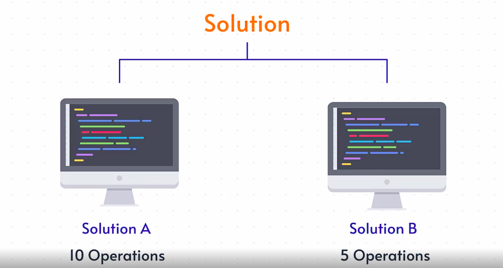
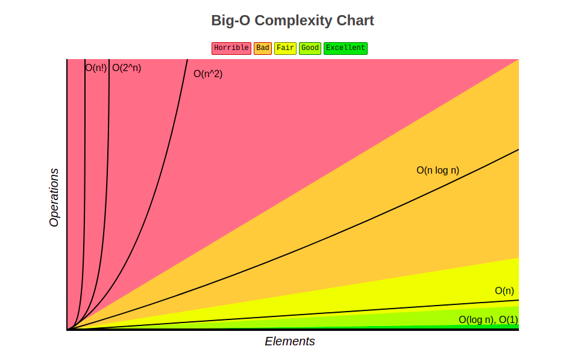

## How to define Good Code?

* We define good code based on two factors i.e.,
* Hum acha code 2 factors se define kartin
1. Readability
    - code padne layak hy ni phele woh check kartin.
2. Scalability
    - bole tho 2 main sub factors 
    1. Time complexity
        - Amount of time it takes to run an algorithm.
        - ek algorithm ku run hone kitna time lagta use ham time complexity se check kartin.
    2. Space/Memory complexity
        - Amount of extra space our algorithm requires.
        - ek alogirthm me kitna space consume hora ha hy woh check karne space complexity use kartin


## BigO Notation:
- agar hum ek problem dekhe uske multiple solutions rehtin,lekin usme kaunsa acha woh decide karne ke liye hum 2 factors(Readability & Scalability) use kartin.

- yeh sirf performance parameter(execution time yaan Space) ke jaise, joh apko help karega apne code base ko rate karne me.

Iske different rating terms hy code ko define karte jaise,
- Horrible
- Bad
- Fair
- Good 
- Excellent

## Why do we need  Big O?

- idar hum ek udaharan dekhenge, kyun hum calculate nahi karenge **time ko minute yaan seconds me**.

- har system ka alag configurataions rehti usse hamko alag alag execution time milta.

- Iske liye hum execution time/system time par dependent ny rehte, aur yahi karan hy Big O notation use karne ki wajah.

- Kitne **number of steps** me hum apna program run karsakte hy uss par **Big O** adarith rehta hy.

- Sidi si baat, Big O humko ek algorithm run hone me kitne time lagta hy woh answer deta hy.

---
## Big O(n):



- Manlo ek problem ke do solutions hy aur **Solution A me 10 operations** lage, aur **Solution B ko 5 operations** lage run hone me, tho hum bolsakte hy **Solution B is better than Solution A**. Kyunki number of operations on solution B is less than solution A.

- Isse hum time complexity ko calculate karsaktin, kitne number of operations me hum apna algorithm run sakte hyn.



- **O(n)** jab operations me **Loops(for, while, etc.,)** rehtin use hum O(n) se denote kartin.

- **O(1)** , jab operations me constants rehtin use O(1) se denote kartin.

- X-Axis **Elements(Number of inputs)** jaise variable assignments and so.

- Y-Axis **Operations** bole tho number of operations jaise loops,condtions kitne baar run hua ho waise.

```Python

student_list1 = ["Raees", "Irfan", "Naseer"]

student_list2 = ["Irshad", "Sardar", "Rizwan", "Yunus"]

# idar student_list1 se ek input lete hy aur comparison opertion perform karte hyn aur usse **for loop** me rak kar daurate rehte hyn jabtak apna desired output se match nahi hota(isko hum operations bi bolte hyn)

# yeh function totally dependent hy number of input par, jaise 2 input milne par 2 operations, 3 milne par 3 operations waise.,
def checkStudent(student_list1):
    for student in student_list1: #time complexity is 0(n)
        if student == "Naseer":
            print(student)

# isse hum bolsakte hy hum 4 inputs diye hy aur 4 operations perform hua hy

# agar hum pattern dekho tho linear(straight) path bolsakte hyn.

checkStudent(student_list1)

# agar hum yeh problem ka conclusion bole tho, yeh problem follows linear(straight) path, so it is Big0(n)

# Here 'n' is the number of elements we have 
```

* Big0 yeh ek common pattern jo har problem me dekhne ko milega mostly.

### Agar number of inputs = number of operations, tab yeh follow karta hy linear path, so the complexity is Big0(n).
---
## Big0(1):

* Big0(1) sidi baat constant hy

Example code:
```python
student_list1 = ['areeb', 'irfan', 'raees', 'naseer']

def displayStudent(student_list1):
    print(student_list[0]) #time complexity is 0(1)
    print(student_list[1]) #time complexity is 0(1)

# halaki hamare list me 4 inputs hy lekin hum sirf ek baar operation run karenge.
# yahan hum input par dependent ny hy, hum sirf first element ko display kara rahe hy.

displayStudent(student_list)

# Hum ye code se bolsakte hy, yeh run hota hy constant time me, tho yeh Big0(1).

# kyun, the number of operations we are performing aur number of input we are depending is 1.

# Tho number of operations nahi depend hy input par, tho yeh code execute hoga constant amount of time par.

```

