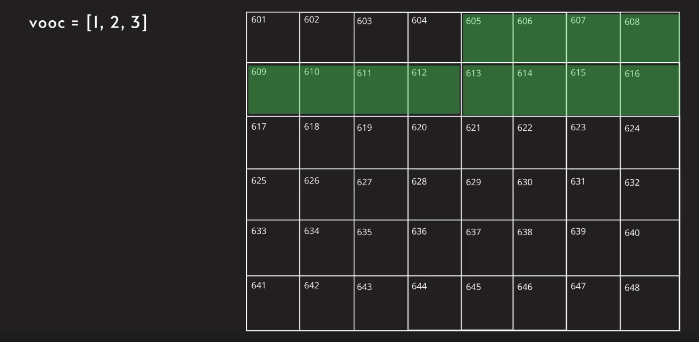
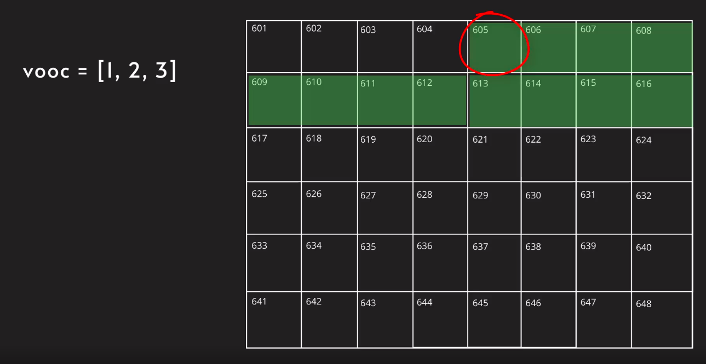

## Arrays:
* Arrays joh hy woh sequential format me store hote hyn, jaise ek ke baad ek, memory slots me.


* chalo idar ek variable lete hyn aur usme 3 elements store karlete hyn.
    - vooc = [1,2,3]
    - Jaisa hum 32 bit of system ko use kar rahe hyn tho 
    yeh 12 bytes of memory slots ko occupy karega.




* Ab chances hy ki, yeh memory slots ke baad yaan phele kuch dusre values bi store hosakte hyn.


* Yaad rakhe, jo number diya hyn sirf utne hin memory slots book hote hyn.

* ye humko dusre sub topic ki aur ishara karta hy, jaise **types of arrays**.
* Ye basically do prakar ke rehte hyn,
 1. Static: Jo fixed rehte hyn once allocate kardene par.
    - ex: **C, C++, Java ...**
    - isme phele hi declare/initialize kar dete hyn hi, ki idar kitne elements store karna chahte hyn.
    - `once size declare` kardene par, phir ise `change nahi` karsakte, aur yahan par phir aise hi `dusre elements ko append/shaamil nahi karsakte.`
 2. Dynamic: Yeh flexible rehte hyn, yaani ise abhi yaan future me add karsakte hyn.
    - ex: **JavaScript, python ...**
    - isme hum size phele dene ki zarurat nahi hyn, woh `system sambhal lega.`
    - aur isme hum apne `elements ko jitne chahe utna elements add karsakte hyn`. kyunki yeh dynamic rehne se, humko isse bahut saare faide milte hyn.
---
## Common Operations:

* Hamare pass 4 aise common operations jo ki bahut useful hy, jaise 
 - Access
 - Search
 - Insert 
 - Delete

* Hum yeh charon ke time complexities ko yaad rakhna chahiye
    - Average case
    - worst case

## Access:
* Data ko access karna `index` ko use kiya jata hy.
* Eg: vooc = [1,2,3], Agar hum element 3 ko access karna ho, tab index[2] use karke access karsakte.
* Arrays se ek faida yeh hy ki yeh `bahut hi jaldi access karsakte hy, irrespective of its size.`
* Agar hum yeh `time complexity dekhe tho, yeh 0(1)`, which is constant time.
* Iska `time complexity constant` isliye hy, jab elements store karte hy memory slots me, tab use ek `particular address allocate kiya jata hy`, isse hamko agar `element access` karna ho, chahe woh 100 yaan millions me kyun na ho, tabbi hum `fixed amount of time` me access karsakte hyn.



* Every elements on vooc = [1,2,3] variable takes 4 memoryslots.


* phela element(1) start hota slot 605, aur bakhi 3 elements ko book karleta hy, waise hi second element(2) start from slot 609 aur occupies other 3, and third element starts at slot 613 aur occupies other 3.


* Agar hum isme pattern dekho tho aisa milta hy 32 bit system me


* Agar 64 bit system raha tho aisa hota hy


* Aise pattern ko use karke, hum kisi bi value ko particuar amount of time me access karsakte hyn.


* Tho hum bolsakte our array jo hy fixed amount of time me execute hota hy regardless of its size of array.


## Update:

* aap update yaan overwriting karsakte ho, koi bi phele dala hua element array list me.
* Aap index position/number lekar woh element ko update karsakte ho.


* Phele mere ko `index value ka address` ko dhund na padega aur uske baad apne element ko update karsakte hyn.

* Formula for finding index address
    - StartingAddress+index*4
    - Eg: 605+2*4 => 613


* Aur phir aap update karsakte apne naye value se. Isse kya hoga ki my dusre memory address se ched chad nahi karunga.

* Yahan time complexity me dekha jaya tho, idar time consumption har ek ko, same(constant) time utilize hota hy, chahe woh 100 yaan thousands me kyun na ho.

## Traversal:

- Visiting each and every element of array.
* Bole tho har ek array element ke pass se guzar na.
* Agar hum traversal use karna ho tho, hum for loop use karenge, aur jaise aapko pata hy for loop ka time complexity 0(n) hy.

* Agar mere pass 100 elements ho tab, 100 elements hokar guzar na hoga, isse bolsakte hy ki, yeh linear path par ishara kar raha hy. Isliye iska time complexity 0(n) hy.


## Search:

* Searching ek aisa operation bolsakte ho, jo traversing ho apne aap.
* Searching me aap har ek element jao ge aur usse previous element se compare karoge.


```Python
vooc = [12,3,4,5,67,8,9,12]
index = 0

for element in vooc:
    if element == 12:
        print('index position',index)
    index+=1

```

* Agar humko index value ko dhund na ho, tab for loop use karke har element ko check karta hy sequentially, aur conditional operator use karke apne value ko compare karta hy desired value se. Agar match hua tho woh index value return karta hy yaan phir next element ke paas ja kar check karta hy, waisa aage aage ja kar karta hy.

* Jaise aage sequential(linear) path me move ho raha hy aur for loop use kiya hy tho, iska time complexity 0(n) hy.


## Copy:

* Copying complete array to a new location.
* Copy karna completet array ko, ek naye location par aur exact values ke saath.
* Jab bi aap ek array ko copy kar rahe ho, tab aap somehow traversing kar rahe hyn.
* Copy jo hy woh ek heavy task hy system ke liye. Kyunki woh har element se paas hona padega aur usse naya memory slots ko dhund na padega aur wahan par complete array store karna padega.


* Kyun? array ko copy karna buri choice hy, thode situations me. Yeh pura depend array size par depend hota hy. Soche agar apke pass 10 elements hy tho asan hoga, agar wahin 1000 elements tab kuch jiyada hi time aur extra space lele ga. Jaise agar aap array ko duplicate kar rahe ho, tho aap double space ko use kar rahe ho.

* Iska time complexity 0(n) hy., kyunki yahan par for loop use kiya jata hy.  

## Insert:

* Ek naye element ko add karna aapne array list me.

* Insertion jo hy woh three jaga par hosakti hy,
    - Beginning
    - Middle
    - End

* Agar hum dusre operations se compare kare tho, yeh ek heaviest task hy.


* Yahan example lekar analyse karte hyn, kya hoga jab hum ek naya element insert karenge aapne memory canvas me? 

* Jab bhi aap ek naya element insert karte ho, particular index par, `tab wahan woh element ke memory slots ko move hona padega naya element ke liye.`


* Manlo agar apke 3 elements ke list me, ek naya element add karte ho beginning par, tho woh saare elements ko move karna padega ek naya location per, aur hum bol nahi sakte ki memory slots available hote hyn yaan nahi iske immediate location ke baad. Agar space available na ho, tab yeh `ek naye location ko search karti hy with one extra slot ke saath` aur wahan per move karti hy. Manlo `phele aapko 12 memory slots me hota tha, lekin ab aapko 16 memory slots me hoga`.


* Insertion ke baad `previous memory slots ko free up `kardegi aur kisi bi cheez ko allocate nahi karegi. Aur iske baad `aapke variable ek naya address par point karegi`.


* Tho aap dekh sakte hyn, yeh process ke liye internally copying aur traversing operation use hota hy aur iska time complexity linear path me indicate karta hyn isliye 0(n) hy.


* Abhi tak hum sirf **`static types of array`** ke baare me discuss kar rahe.
* Array me dusra type bi rehta hy, jaise **`dynamc array`**.

* **`Python yaan JavaScript`** dynamic arrays use karte hyn.

## Dynamic Arrays:

* Jaise ki aapko pata hy **`dynamic arrays`** apne size ko change karsakte hyn.

* In **`C++`**, usse **`array list yaan vector`** ke naam se jaane jate hyn, in **`Python`** usse **`list`** bulate hyn jo ki ek standard array hy.

* Dynamic arrays me faster insertion hota hy.

* Chaliye aap ko iske memory canvas me dekhte hyn, kaise dynamic arrays elements ko store karte hyn. Jaise ki aap ko pata hy static array me jab aap 3 elements ko store karenge tho woh 12 memory slots ku book karta hy, lekin jab aap dynamic array me 3 elements ko store karte hyn, tho 16 memory slots ko book karta hy.


* Dynamic array me jab apke paas 3 elements ho tab, 4 memory slots ko book karta hy. Agar 4 elements ho tabbi 4 slots ko book karta hy, lekin 5 elements ho tab 8 slots book karta hy. Agar yahan pattern dekho aisa dekhne ko milega,

- 2^1 = 2
    * Yahan right hand side value elements ko denote karti hy.
- 2^2 = 4
    * Agar 4 elements ho tho 4 slots book karegi
- 2^3 = 8
    * Agar 5 elements ho tab 8 slots book hoga, kyunki yeh even number ke hisaab se book karegi
- 2^4 = 16
- 2^5 = 32
- 2^6 = 64
- 2^7 = 128

* Isse aap apne array ko freely append karsakte certain limited size tak, lekin jab limit exceed karenge taabi woh naaye location ko shift karta hy.

* 4 elements me 4 slots hoga jaise,


* 4 elements me 8 slots hoga jaise,


* Isme my aur 3 elements add karsakta hun, tabbi size change nahi hoga.

* Agar my 9 elements add karta hun, tho 16 memory slots ko occupy karega(2^4=16).

* For Static Arrays time complexity is 0(n).
* For Dynamic Arrays time complexity is
    - 0(1) - Best case
    - 0(n)-Edge cases, depending on situation - Worst case
* Jiyada tak situation me 0(1) rahega, lekin kuch halaat par jaise 4,8,16,32.. tab 0(n) hoga.


## Delete:

* Array deletion, 3 jagao par hosakta hy jaise,


* Agar hum last element ko delete karna chate hyn, tab hum sirf last element ke index ko access karte hy aur delete karte hyn.


* Agar hum time complexity dekho tho, hum sirf first element ka index position lekar calculate karenga last element index position aur phir deletion karenge., tho yeh time constant hy jo ki 0(1).
* Agar hamare element first yaan middle me hyn, tab uska time complexity 0(n) hy, kyun ki after deletion, saare memory slots ki position change hoti hy.


