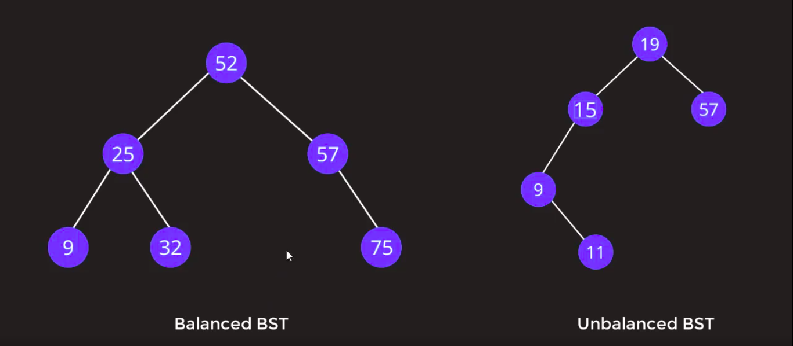

# Binary Search Tree:

* In Binary Tree/Binary Search Tree me kya hy bole tho, **`left side ke nodes me values less than rehte root node  value, waise hi right side ke nodes me values greater than root value.`**

## Types of Binary Search Tree(BST):

1. Balanced BST
    - Yeh balanced hy, jab tak iska differnce of height dekhnge tho match hona chahiye left yaan right sub trees se, aur difference 1 hona chahiye, agar 1 se jiyada hy tab yeh unbalalnced hy.

2. Unbalanced BST
    - Agar height of sub trees match na ho left aur right subtrees tab yeh unbalanced hy.

