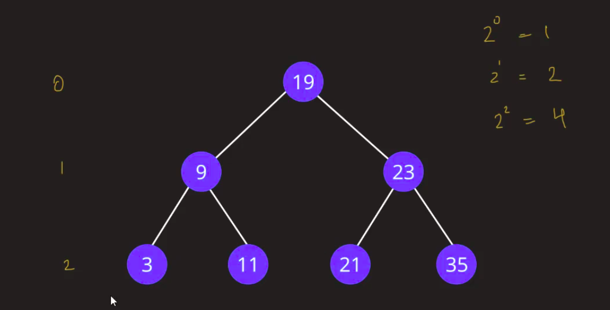
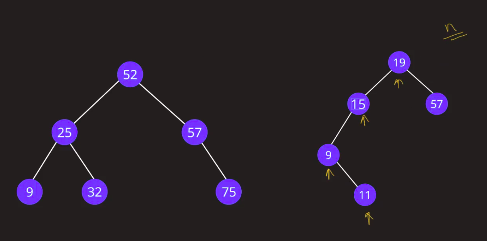

# Binary Search Tree:

* In binary tree, hum sirf do hi child raksakte hyn.

* In Binary Search Tree me kya hy bole tho, **`left side ke elements less than root element, aur right side ke elements me greater than root element.`**

## Types of Binary Search Tree(BST):


1. Balanced BST
    - Yeh balanced hy, agar difference of height dekhe tho, uska difference jo hy greater than 1 se jiyada ny hona chahiya left aur right sub tree se compare kare tho.
        - *`Root difference = Height of left subtree - Height of right subtree`*
        - From fig, calculating difference,
            > d = 1 - 1 => 0 => it is balanced BST.
    - Jab balanced BST se kam karte hy, height depend rehta hy, iska *`compelexity = logn`*
2. Unbalanced BST
    - Agar height of sub trees match na ho left aur right subtrees tab yeh unbalanced hy.
        - *`Root difference = Height of left subtree - Height of right subtree`*
        - From fig, calculating difference,
            > d = 2 - 0 => 2 => it is unbalanced BST.
    - *`Complexity = n`*



- 2^0 = 1
    - Here power 0 indicate height, and 1 on right side indicate elements.
- 2^1 = 2
    - 2 elements, height is 1
- 2^2 = 4
    - 4 elements, height is 2

- Agar observer kare bolsakte ki, leaf elements are greater than the above total elements.

- Agar hum ko number of nodes phechan na ho tho, yeh formula me convert karenge jaise, 
    - n = 2^h+1 - 1
        - 'n' elements hy
        - 'h' height hy
- Agar height pehchan ho tho yeh formula use karenge,
    ```
    > n = (2^h+1)-1
    > 2^h+1 = n+1
    > h = log(n+1)-1
    ```
- Edge depends on logn.

## BST Search:


- Agar mere ku kuch 35 element ko dekhna ho tho phele root element se compare karunga, agar less than root hy tho left side ke elements yaan phir greater than raha right side ke elements me jaunga. Jaane ke baad ignore karunga jo bi side elements ko.

- Iska complexity hoga log(7) ~ 3.




## BST Insert:


## BST Delete:


### Problems when we keep on adding elements:

* Firstly, hamara tree jo hy unbalanced ke isme chalejata.


## AVL Trees Versus Red Black Trees:

* yeh apko help karenge tree ko balance rakhne me.

* AVL trees me agar difference 2 se jiyada ho root element se tab balancing karega.

- [RedBlackTreesVisulization Link](https://www.cs.usfca.edu/~galles/visualization/RedBlack.html)
- [AVL trees visulization](https://visualgo.net/en/bst)