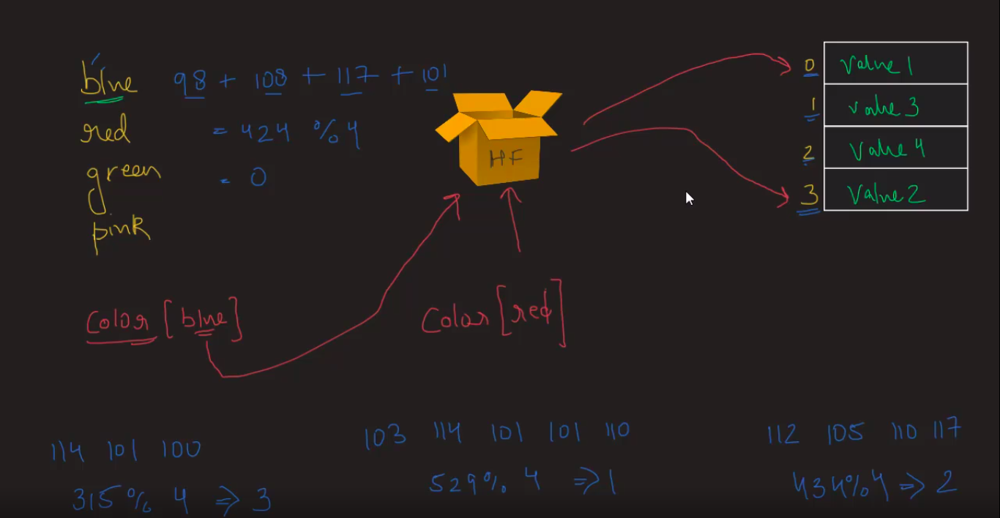

# Hash Tables:

* Hash tables jo hy woh ek bahut hi important fundamental data structure concept hy.

* Hash tables jo hy, ek cheez ke liye bahut hi famous hy, jo ki **`search complexity 0(1) hy.`**

* Jaise ki aapko pata hy **`search complexity for array aur linked list ka 0(n)`** jo ki linear hy.

* Hash tables jo hy woh **`phele se predefined hote hy, jaise python me Dictionary, Java me Maps, JavaScript me Objects, Ruby me Hashes`** ke tarah.

* Hash tables ek hy aisa topic hy jisko aap jitna deep explore karege utne bahut saare sub topics dekhne ko milega, isliye yeh ek bahut hard topic hy. Isliye hum iske baare me knowledge limited rakhenge, kyunki confusion na ho.

* Hash tables jo hy woh elements ko key aur value pair me store karta hy.

* Jaise array me index position par dependent rehte hyn, waise yaghan par hum **`"key" position par dependent rehte hyn.`**

* Tho usme phele faida yeh hy ki, jabbi apko element search karna ho tho hum directly key position lekar find karsakte hyn, bina traverse ke.

* Yahan par ek udharan lete hyn jaise yeh hash table me color jo ki key jaisa, aur color code jo ki value ki tarah store karenge, aur dekhenge in form of arrays aur linked list patterns me.

* Yahan par "key" jo hy woh hash function ko dete hy, aur wahan se humko return index position milta hy. Agar my mere code ko phir se run karun tho woh, hash function phir se index position ko generate nahi karega.

* Jab bi aap haar baar kisi bi key ke saath kaam karenge tho usko pata hota uska khudka generate kiya gaya index position aur system ko pata hota hy, ke hum usse kahan se access karsakte hyn.

## Hash Function:

* Hash function jo hy woh "key" string ko lekar ek **`md5 hash`** generate karta hy, jo ki ek tarah ki string ko generate karta hy.

* Hum khudka ka bi hashing ko create karsakte hyn. Manlo ki hum, 4 key strings dete hy tho, uske index positions humko return milte hyn. Yahan par hum phele strings ko ASCII values me convert karte hyn

    - {blue: value1, green: value3, red: value2, pink: value0 }
    - blue =  98+108+117+101 => 424% 4 => 0

 

## Collision: 

* Agar aap same **`keys values ko store karte hyn, same index position par tab collision hoga.`** Waise **`situation me humare keys jo hy woh linked list pattern use karke same keys values ko store karte hyn. `**

* Isme humko different solutions hy jaise linked list tarah jaise,
    - Chaining
    - Overflow areas
    - Rehashing
    - Quadratic probing
    - Linear probing
    - Random probing aur bahut ...

* Agar same keys values generate hokar linked list pattern me store hote hyn tho uski time complexity jo hy woh change hojati hy 0(n), kyunki agar hum kisi bhi value ko access karna chahate hyn tab woh traversing ho kar value ko access karna padega. Aur yeh tabi hoga jab hum khudke hashing functions ko use karenge tho.

 

### Complexities:
- Access jo hy woh search ki tarah same hy, kyunki woh ek tarah ko apna te hy.
- Search
    - Average Case, ise 0(1) rahega kyunki hash function jo hy woh constant rahega.
    - Edge Case, me 0(n) agar collision use karna pada tho.

- Insert
    - Average Case is 0(1), sirf key dena hy index ke saath aur insert karsakte ho.
    - Edge Case, me 0(n) agar collision use karna pada tho.

- Delete
    - Average Case is 0(1), sirf key dena hy index ke saath aur delete karsakte ho.
    - Edge Case, me 0(n) agar collision use karna pada tho.

* By default, hash tables jo hy woh dynamic hote hyn, dynamic bole tho (2 elements ke liye 4 slots)2^2 = 4, slots ko use karte hyn.