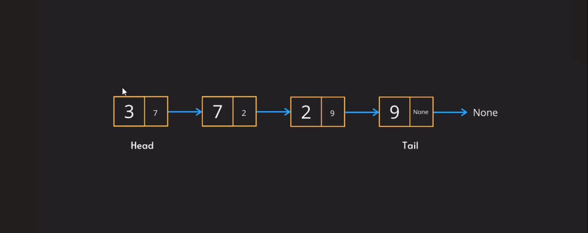

# Linked List:

* Yeh bahut hi **`fundamental concept`** hy array jaisa kyun ki, yeh concept hum **`dusre data structures me bi utilize karsakte hyn`**, Jaise array concept stack aur queue me bi use hota hy waise hi.


* Agar LinkedList ki baat kare tho yeh different hy array se, values ko memory me store karne me.

* mane **`array ke jaise sequential format`** me store ny karte, **`linkedlist random locations me values ko store karte.`**

* Yeh ek bahut major difference hy array aur linked list me.

* Jabki kabhi aap linked list store karte hy memory me uske thode rules hy jaise,
    1. uska representation kaisa hoga
        - Linked List jo hy **`node`** se represent karte hy.
        - Array me elements one after other rehte hy, aur usse index value bi rehti hy.
    2. Aur uska types kya hoga

## Representation of LinkedList:



* Chalo ek example list lete hy jaise [3,7,2,9], phele yeh list node me convert hota hy, node kya hy? Node kuch bi ny ek structure ke jaisa hy, jaise manlo **`phela element leta hy aur store karta hy aur saath hi next element ka pointer/memory Address(use 'next' karke bi bulatin) store karta hy.`**


* First element linked list ka **`Head/Start`** se bulate hy hy, aur last element **`Tail`** kehte hy.

* The flow of linked list element shuru hota hy **`left`** se. 

* Last element ka pointer **`None`** ke aur ishara karta hy.

* Kyun ki **`pointer se next element ko address karsakte hy, isse humko ek faida yeh ki hum next element kahin par bi store karsakte hyn.`**

* Jaisa ki aapko pata hy har element occupy karta 4 memory slots ko, waise hi **`linked list me, 4 memory slots ko occupy karta hy aur saath hi next element ke memory address ke liye aur 4 memory slots occupy hote hyn.`**

* Last element(Tail) me 'None' ke liye bi 4 memory slots occupy hote hyn.

* Tho conclusion yeh hy ki **`one element store karne 8 memory slots use hote hyn 32 bit system me.`**

* Isse calulation aise karte hyn
    * Example: [3,7,4,2]
        - head.value = 3
        - head.next = 7

## Types of Linked List:

### 1. Singly
### 2. Doubly


* Har node me 3 elements rehti, Jaise first node(Head) me Previous element memory address, Current Element(data), Next Element memory address ko store karte hyn.


* One cheez dhyaan rakhne ki jarurat hy, woh yeh hy ki **`linked list me index position ny rehta.`**

# Linked List Complexities:

* Access
* Search
* Insert
* Delete

## Access:

* Manlo agar apko ek particular element ko access karna ho, tab actually apko traverse hona padega

- Ex: [3,7,2,9]
    - Agar mere ko 3 element ko access karna ho tab, phele first element ke pass jaunga, aur next element ka address lekar second element ke pass jaunga, phir wahan se third element ka address lekar third element ke pass jaunga.
    - Simple se bolna hy tho **`har element ko iterate karna padega jabtak apke desired value ny milta, tab tak iterate hota hy.`**

* Jaise ki yeh travel hota first se last, yaani straight path me, iska **`time complexity 0(n) hy.`**

## Search:

* Yahan per bi traversing karke har ek element ko compare karta hy, agar required element se match hota hy tho woh element ko return kardeta hy.

* **`Time Complexity is 0(n)`**

## Insert

* Insertion 3 jagaon per hosakta jaise start, end yaan middle.
* Manlo agar aap element ko first add karna chahate ho tab, woh element ko add karega aur phele wale ka memory address ko store karega, usse automatically woh Head banjayega.


* **`Time complexity is 0(1) agar element phele se pata ho`**, yaan phir **`0(n) agar element ko malum karna ho.`**

## Delete:

* Deletion 3 jagaon per hoti hy jaise,
    - Start
    - End
    - Middle


* Agar my first element Head ko delete karta hun tho, uska next address ka element Head banjata hy.

* Hum sirf **`first element Head ka reference change`** kardiye tho **`first element delete hojata hy.`**.

* Agar last element delete karna ho, phele previous element me jakar sirf next element ke address per none likhdiye tho baas hy, automatically last element delete hojaye ga.

* Agar hum middle yaan end element ko delete karna ho, tho phele list me traverse hona padega, aur tab required element match hogaya tho deletion perform karsaktin.

* Element deletion ke baad garbage value ke jakar, wahan se disappear hojata hy.

* **`Time complexity is 0(1) agar element ka position phele se pata ho`**, aur **`0(n) agar phele baar ho tho`**.

## Doubly Linked List:


* Agar hum ko ek element store karna ho tho 12 memory slots ko use karta hy.
    - Har Node element me theen data hote hy jaise
        - Previous Data, Data, Next Data
    - Jaise ke har element ke 4 slots ki jarurat hoti hy.


* Insertion, deletion same hy jaisa singly linked list me tha.


* Time complexity are same hy jaise singly linked list me tha, 0(1) agar malum ho, 0(n) agar malum na ho.

## Circular Linked List:

* Circular linked list me last node jo none value hy usme Head value ko refer karte hain.   


* Agar humko insert, delete, access yaan search woh tho same traverse ho kar operation perform karega.

## Implementing a Linked List:

### Singly Linked List:

* Yahan hum do cheeze par guar kare tho 
    1. Node ko create karenge
    2. Nodes ku link karenge

### Class-based implementation:

1. First Node class create karenge taake hum alag alag nodes ko create karsake, Jaise node 1, node 2, node 3...

2. Second hum Linked List class create karenge jisme, linked list values jaise head, tail aur methods jaise  insertion, deletion, access, traversal, search, and hum iska length bi jan sakte hyn.

```python

class Node:
    def __init__(self, value=None, next=None):
    # def __init__(self, value=None, next=None, prev=None):
    # if it is a doubly linked list
        self.value = value
        self.next = next
        # self.prev = prev

class LinkedList:
    def __init__(self):
        self.head = None

    def insert():
        pass
    
    def delete():
        pass


n1 = Node(3)
n2 = Node(7)
n3 = Node(2)
n4 = Node(9)

LL = LinkedList()
LL.head = n1
n1.next = n2 # LL.head.next = n2
# n2.prev = n1
n2.next = n3
n3.next = n4


```


