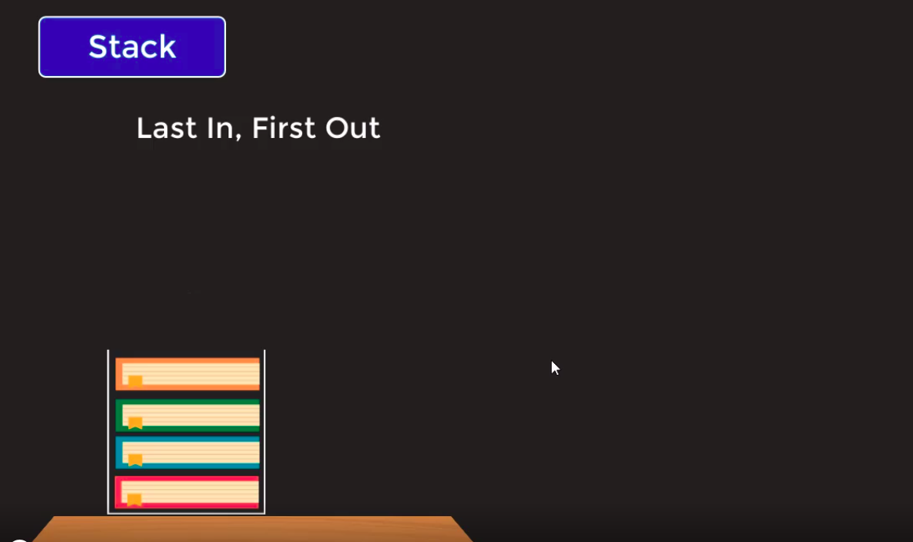

# Stacks:

* Stack data structure jo hy woh **`last in, first out`** (or LIFO principle) pattern ko use karta hy.

* Stacks jo hy woh array yaan phir linked list pattern me elements ko store karsakte hyn.

* Yahan par dusre elements ko access ny karsakte jab tak ki hum last element se bahar ny ajate.

* Agar hum array pattern ke sequence me elements ko add kare tho iska time complexity 0(1) hoga.

* Agar hum **`delete/insert operation kare tho, sirf last element ke baad add/remove karsakte hyn.`**

* Yahan per hum 3 terms ko use karenge jaise,
    - **`pop(delete item)`**
    - **`peek or top (return the last item available)`**
    - **`push(add item)`**

* Hum yahan par min yaan max methods use karke min or max value find karsakte hyn apne stack me.

# Queue:

* **`Follow principal of First in, First out.`**

* Yahan par agar mereko element add karna hoto last me add karunga, aur remove karna ho tho first element ko nikalunga.

* Isme 3 rakham ke methods hy jaise,
    - deque (jo ki delete karne use karte hyn)
        - agar **`deque use karunga tho list ka first 
        element jo add hua tha woh delete hoga`**.
    - enque (element add karne ke liye)
        - **`agar enque use karunga tho first element ke phele add hoga`**
    - peak or top (first element jo add hua list me)
        - **`agar peak/top use karunga tho first element jo add hua list me usse point karega`**

* Time complexities for delete, access will be 0(1). For insert 0(1) for last element, aur 0(n) edge cases(worst case) ke liye. For search 0(n), kyunki woh traverse hona padega.

## Note:

* For Stacks, array pattern jo hy woh best hy, agar time complexity ke hisaab se dekha gaya tho.

* For Queue, agar hum array pattern use karte hyn tho, **`delete(deque) ke liye 0(n) hoga kyunki, delete ke baad hum har element ko shift karna padega.`**, aur **`insert(enque) ke liye 0(1), kyunki woh sirf element ko akhir me add kardega.`**, aur **`peak/top ke liye 0(1) hoga.`** kyunki jabki kabhi bi aap array ke saath kaam karte hy tho first element ka memory mojud hota hy.

* Tho, Queue ke linked list pattern best mana jata hy, kyunki usse hum asani se deque, enque yaan phir peak karsakte hyn. Aur iska time complexities bi 3 ke liye 0(1) rahega.

