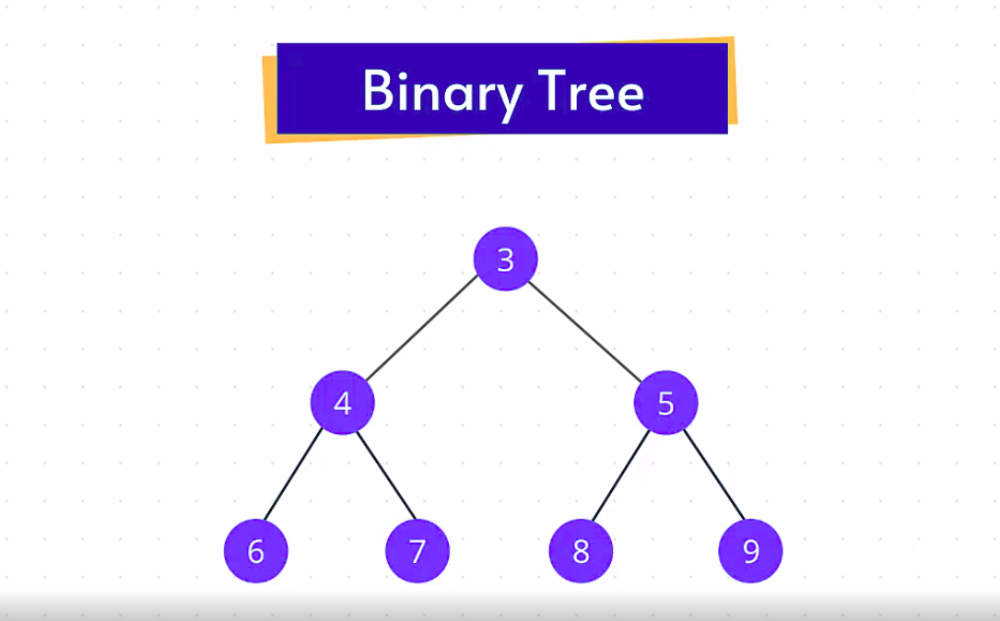
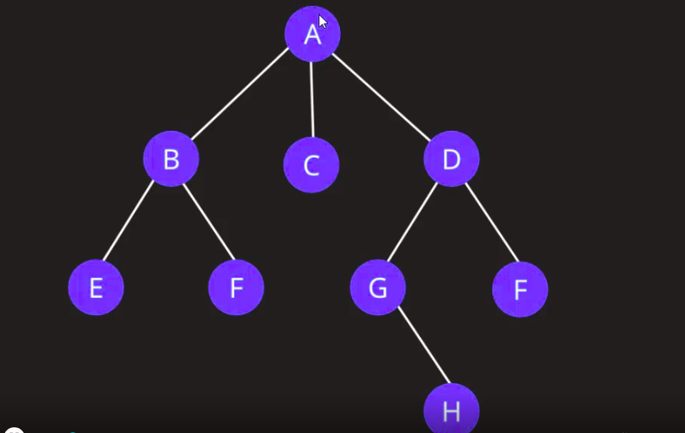
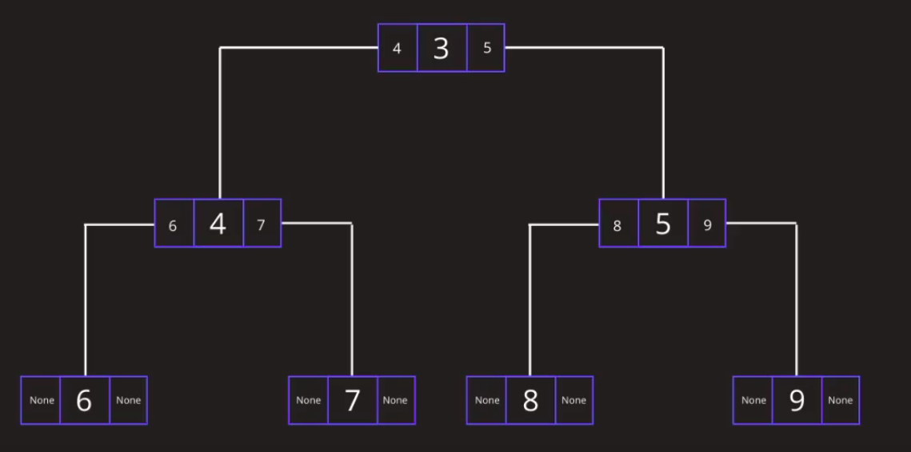
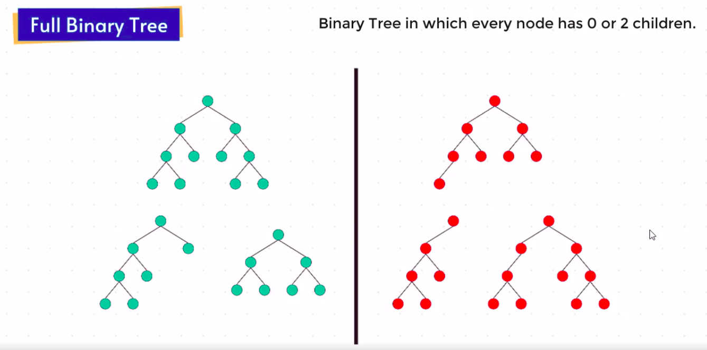
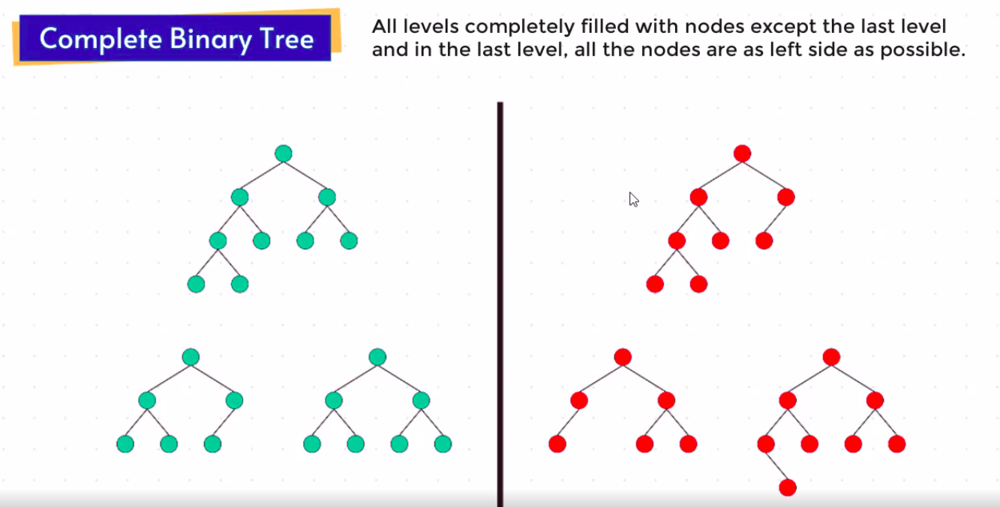
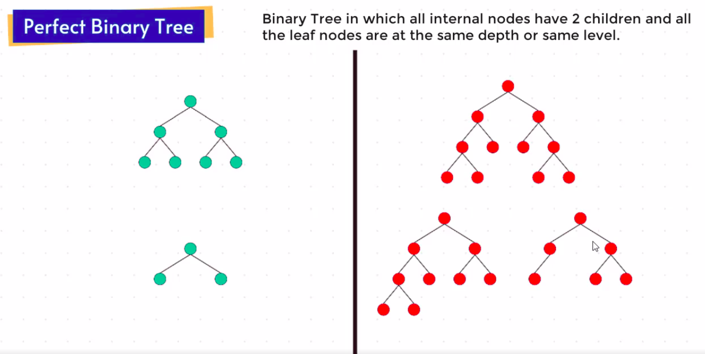
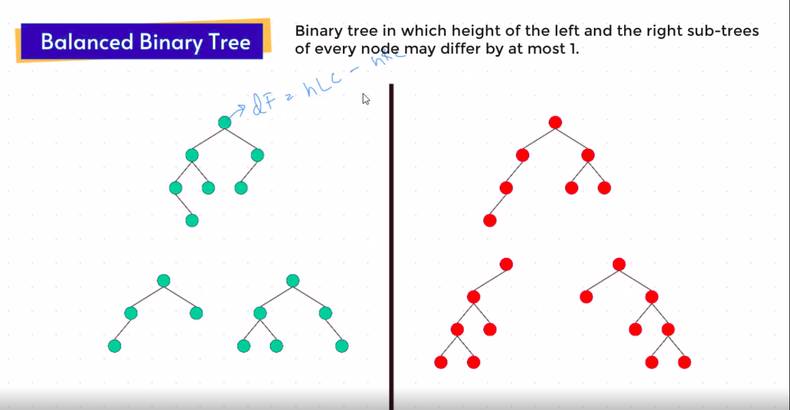
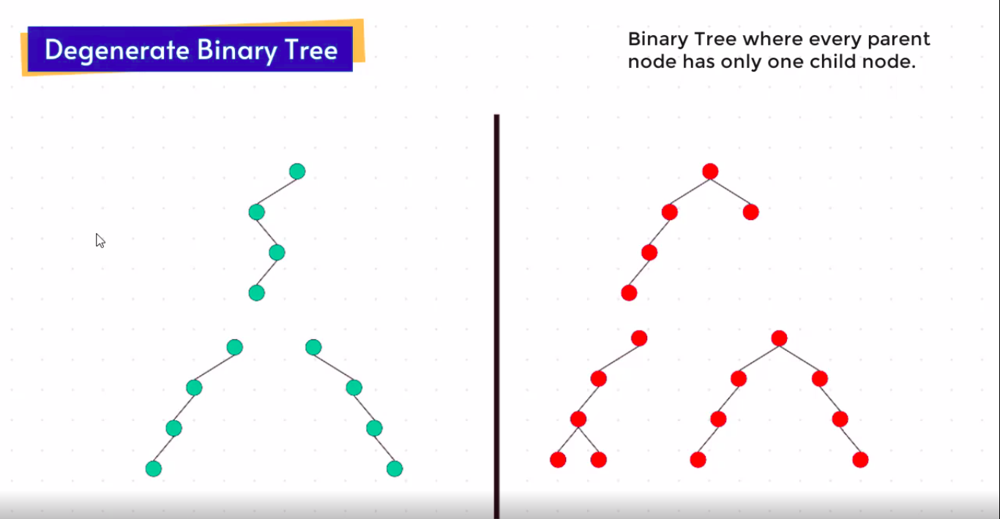

# Trees

* Tree jo hy woh **`hierarchical data structrure.`** 
* Start hota parent element se phir sub element aur uske sub elements.
* Important terms in trees are
    - Node
        - jabbi har element convert hota form me
    - Root
        - Starting point bolsakte ho
    - Parent
    - Child
    - Leaf node
        - last element that has no child 
    - Sibling
    - Edge
        - connection of one element to another element
    - Levels
        - levels like parent, child ...
    - Path
        - path kato ek node se dusre node ka path
        - jaise 3-9 path bole tho 3-2-5-9 aisa
    - Subtrees
        - bole tho tree me ek child aur uske children ko alag se nikal le tho woh hisse ko sub trees boltin

* Chalo ek real life scenario lekar dekhte hyn.

* Yahan par mera status jo hy woh root node hoga aur comments jo hy woh child nodes, aur replies uske child nodes waisa.

* Hum html file bi example ke tarah dekh sakte hyn, jaise usme root tag html hota hy aur head, body uske child tags ke jaisa, aur body me phir sub tags rehtin waisa.

* Child ko sirf ek hi parent rahega.
* Direction me dekhe tho hum left yaan child me jasakte hyn.

* Trees me 2 important terms jaise

### Depth
        - Depth boleto kaunse bi node se shuru hoke root node tak, kitne edges lagi woh dekhte hyn.
        - The depth of any node is the number of edges from that node to the root node.

### Height:

        - Height boleto kaunse bi node se shuru hoke use sab se akhir wale node tak kitne edges hy woh boltin.
        - The height of any node is the number of edges from that node to that deapest leaf.

* Agar my yeh tree ka height bolun tho, 3 hy, jaise     A->D->G->H.
    - Height of tree = Height of root node.
* Aur Node H depth bolun tho 3 hy, jaise H->G->D->A

* Agar edges calculate kare tho
    - Number of nodes - 1(root node)

# Binary Tree:

* Binary tree me har child jiyada tak 2 childs rak sakta hy. Bole tho ek child 2 se jiyada yaan phir 2 se kum nahi rakh sakta binary tree me.

* The below one is **`not a binary tree.`**

* Binary Tree me har element node ke form me store hota.
* Isme **`data.left, data, data.right`** rehtin, har ek node me.

* Types of Binary Tree:
    1. **`Full Binary Tree`**
    2. **`Complete Binary Tree`**
    3. **`Perfect BinaryTree`**
    4. **`Balanced BinaryTree`**
    5. **`Degenarate BinaryTree`**

## 1. Full BinaryTree:

* Isme har **`node me 0 or 2 children rehtin`**.

## 2. Complete BinaryTree:

* Isme har levels me equally *`nodes fill hoko rehtin`*, sirf *`last level chodke`*, aur last node jo hy woh *`left aligned rahenge.`* yaan phir complete rehte hyn.

## 3. Perfect BinaryTree:

* Isme kya hy, sab nodes me 2 children rehtin aur sab leaf nodes jo hy woh ek hi depth yaan same level me rehtin.

## 4. Balanced BinaryTree:

* Isme hum har node ko individually dekhnge, aur *`difference dekhenge left node height aur right node height`* se, agar *`difference sirf 1 or 0 raha tho ok`*, ny tho it is not a balanced binary tree.

* Simple se boln bole tho *`yeh hieght of left & right subtrees ke upar depend rehta hy.`*

## 5. Degenerate BinaryTree:

* Isme kya bole *`har node ku sirf ek child rehta.`*

