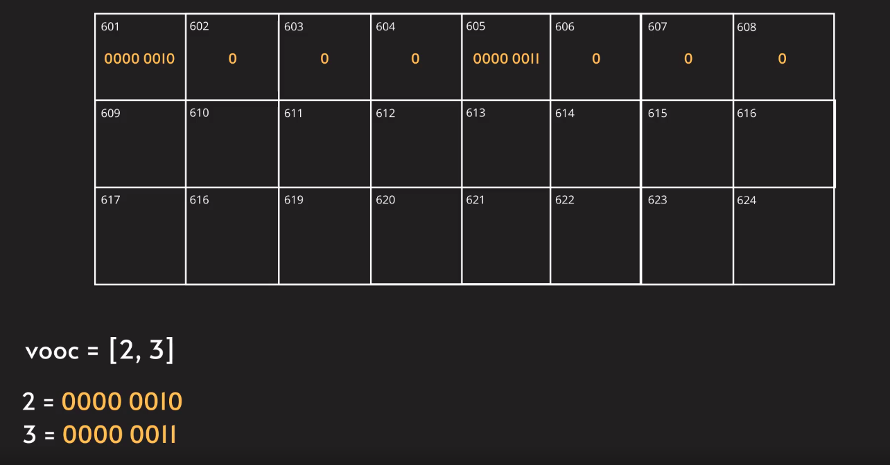
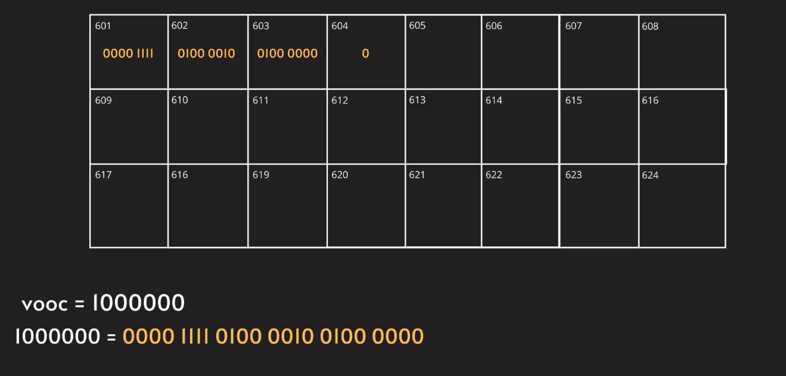

## Memory:

* Memory kate so bahut important hy ek computer science student, kyun ke isse hamko memory ko visualize karne me dekh milega.

* Jaise aap ko patha hy memory kuch bhi store karne ke liye use kiya jata hy.

* Memory jo hy woh alag alag memory slots me bata jata hy.

    - 1 memory slot = 8 Bit
    - 8 Bits = 1 Byte
    - tho 1 memory byte = 1 byte

* Agar my systems ki baat karun humko patha hy uska architecture 32-bit yaan 64-bit me rehta hy.

* Manlo ki my ek 32 bit system me ek integer ko initialize karta hun, tho woh 32 bit occupy karta hy.

* Ex. 32 bit = 4 byte (joh ki 4 memory slots ko book karta hy)

* Tho, agar my ek variable leta hun 'vooc' bolke aur usme ek integer store karta hun, tho woh 32 bit format me memory slot ko occupy karta hy.

* jab my variable vooc ko memory me store karta hun tho 4 bytes of memory slots ko book karta hy, aur uska address dekhne ko milta

* woh memory address hexadecimal format me rehta hy.
* Aur joh variable values store hote hyn memory slot me, woh binary number format me rehte hyn.

* manlo ki my ek variable list(vooc = [2,3]) leta hun tho woh memeory me 8 bits occupy karta hy aur woh bhi altogether.

* Jaisa ki apko pata every input jo hy woh binary format me convert hokor store hota hy.

* jabki variable input convert hota 8 bit me, aur 1 memory slot me 8 bit store kiya ja sakta hy tho jab variable input 2 store karte ho tho woh sirf 1st memory slot me baite ga aur remaining 3 slots me 0 fill karega. Aur same variable input 3 bi waisa hi fill karega.

* agar aapke manlo million digit (vooc = 1000000) ka number hy tho kaisa store hoga.

* jab variable input store karte hy tab, uska memory address hamre pass rehta track karne ke liye.

* tho aap soch rahe honge agar integers aise store hota tho strings kaise store hote hy. well string jo hy ASCII value me store karte hy.

* manlo aapke variable list me 5 inputs hy (supervooc = [1,2,3,4,5]) tho kaise store hota hy memory me.

* manlo aap ke variable (supervooc = [2,3]) me do values hy, tab woh 2 memory slots ko book karega. Aur uske baad ke memoryslots me koi dusre input store hosakte. Agar mereko in future extra input store karta hun apne variable me (supervooc = [2,3,4,5,6]), toh uske bajuk ke memory slots me nahi rahenge.

* Agar mereko usme immediate yaan bajume chahiye, tab aap pointers use kar ke woh specific address ko point karsakte hy.

