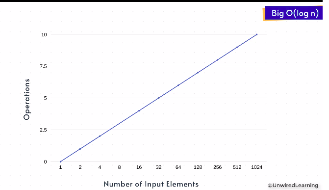
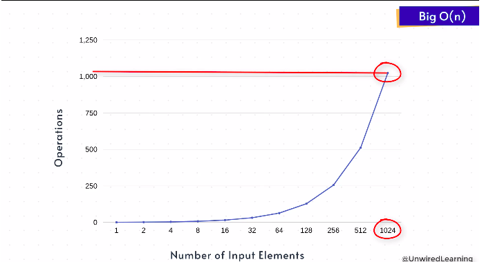

## Logarithm:

> log{base b}(n) = y => b^y = n. 

* Yahan par hum hamesha yeh samajhe ke base value kabi bi 2 rahne computer science me. Agar apne upar wala expression likhe tho aisa dekhenge

```
log{base 2}(n) => 2^y = n

1. log(1) = 0 => 2^0 = 1 => log(1) = 0

2. log(2) = 1 => 2^1 = 2 => log(2) = 1

3. log(4) = 2 => 2^2 = 4 => log(4) = 2

explanation: log(4) = 2, because 2^something = 4, so that value is 2, so 2^2 = 4, so value of log(4) = 2

4. log(8) = 3

5. log(16) = 4

6. log(32) = 5

7. log(64) = 6

8. log(1024) = 10

9. log(1048576) = 20

Agar aap idar pattern ku observer kare tho humko yeh pata chalta hy ki har baar 'n' value ko double karne se sirf 1 value of log increase dekhne ko milega
```

* Yahan par hum yeh isliye discuss kar rahe hy, jab aap yeh complexity analysis me potray kare tho, apko apne Big0 graph bahut hi ache results dekhne ko milega.



* Tho hum yeh graph dekh bolsakte hy, jaise **number of elements** increases hote hyn, waise **number of operations** perform karna sirf thoda increase hoga.

* Tho hum isse yeh bolsakte hyn ki **Big0(log n)** bahut hi acha hy jab aap **Big0(n)** se compare kare tho.



* Tho kahan dekh sakte hyn? Yeh jiyada tak searching aur sorting alogorithms me dekh ne ko milega

### Chalo idar ek simple sa example lekar samajh te hy. mere pass ek list hy aur usme 8 elements ko store karta hun.


```Example: 

      [0,1,2,3,4,5,6,7]
isse my half divide karke apna man chaha operation karunga
  #1  [0,1,2,3]
phir se half karunga
  #2  [0,1]
phirse
  #3  [0]
yahan per 3 steps dekhne ko milega.
so isse log ke hisab se dekhe tho

idar 8 elements hy aur hum 3 operations perform karte hyn
agar ise log me dekhe tho isa dekhne milega log(8) = 3

Agar aap ke odd number me elements ho jaise 5,7,9 and so
tab aap approximately use karenge jaise
log(30)~5 => log(32) = 5

```
